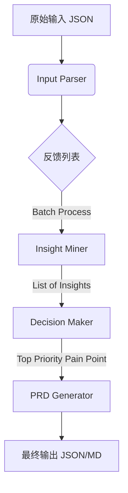

# 系统设计文档 (System Design)

## 1. 架构概览

AutoPRD 采用 **Pipeline (流水线)** 架构，将复杂的 PM 决策过程拆分为多个独立的原子任务。每个任务由专门设计的 Prompt 驱动 DeepSeek-V3.2 模型完成。

### 核心模块

1. **Input Parser (输入解析器)**: 负责加载原始数据，进行格式校验。
2. **Insight Miner (洞察挖掘器)**: 负责对每条反馈进行深度分析，提取痛点和场景。
3. **Decision Maker (决策引擎)**: 负责对聚合后的痛点进行聚类、去重和优先级排序。
4. **PRD Generator (文档生成器)**: 针对 Top 1 痛点生成详细 PRD。

## 2. 数据流向 (Data Flow)



## 3. 模块详细设计

### 3.1 Insight Miner (洞察挖掘器)

- **输入**: 单条或多条 User Feedback + Product Info
- **处理**:
  - 情感分析 (Sentiment Analysis)
  - 意图识别 (Intent Recognition)
  - RCA (Root Cause Analysis)
- **Prompt 策略**: Few-Shot + CoT
  - _Example_: "用户抱怨慢" -> "技术层: 响应延迟" -> "心理层: 焦虑/中断" -> "商业层: 流失风险"

### 3.2 Decision Maker (决策引擎)

- **输入**: 痛点列表 (Insights List)
- **处理**:
  - **聚类 (Clustering)**: 将相似的反馈归并为同一个 Issue。
  - **评分 (Scoring)**: 基于 ICE 模型打分。
    - Impact (影响范围): 涉及多少用户？
    - Confidence (信心指数): 解决该问题带来的收益确定性。
    - Ease (实现难易): 技术成本预估。
- **输出**: 排序后的痛点列表。

### 3.3 PRD Generator (文档生成器)

- **输入**: Top 1 痛点详情 + 产品背景
- **处理**:
  - 生成 User Stories (As a... I want to... So that...)
  - 推导 Functional Requirements (输入/处理/输出)
  - 定义 Acceptance Criteria (Gherkin 风格或条目式)
- **Prompt 策略**: Role-Playing (资深产品经理) + Structured Output Constraint

## 4. 接口设计 (Internal API)

虽然是单体应用，但模块间通过定义好的 Data Class 交互。

```python
# 伪代码示例

class FeedbackItem:
    source: str
    content: str
    user_level: str

class PainPointAnalysis:
    summary: str
    root_cause: str
    scenario: str
    score: float

class PRDDocument:
    title: str
    background: str
    requirements: List[Requirement]
```

## 5. 扩展性设计

- **多模态扩展**: 未来可接入 OCR 识别截图反馈 (DeepSeek-VL)。
- **知识库挂载**: 可接入 RAG 检索历史 PRD 或竞品分析报告。
